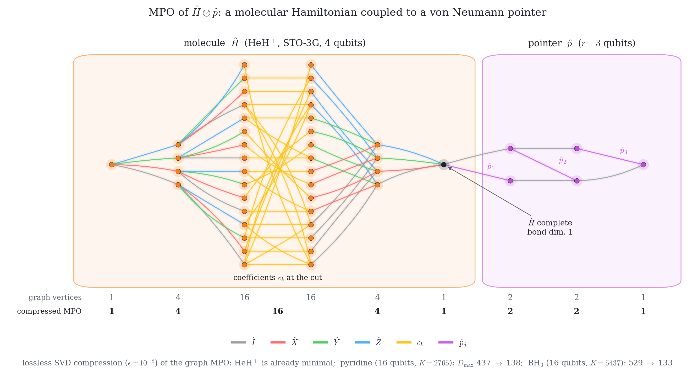

<p align="center">
  <picture>
    <source media="(prefers-color-scheme: dark)" srcset="figures/banner_dark.png">
    
  </picture>
  <br>
  <sub>MPO graph (left/right Pauli-string tries joined by the coefficients at the cut) and its lossless SVD compression,
  following Y. Javanmard, <a href="https://arxiv.org/abs/2603.24822"><i>Coefficient-decoupled matrix product operators as an
  interface to linear-combination-of-unitaries circuits</i>, arXiv:2603.24822</a>.</sub>
</p>

# Tensor-network benchmarking of QPE in the von Neumann measurement formulation — code

This repository is the reproducibility package for the paper

> **Tensor-network benchmarking of quantum phase estimation in the von Neumann
> measurement formulation with DMRG-prepared initial states**
> Younes Javanmard
> arXiv: https://arxiv.org/abs/2407.19348

The quantum protocol studied in the paper is the von Neumann measurement formulation of
phase estimation of Childs *et al.*, Phys. Rev. A **66**, 032314 (2002), and Novo *et al.*,
Quantum **5**, 465 (2021): the system is coupled to an *r*-qubit pointer through
exp(−i t H ⊗ p), p = Σ_j 2^{−j}(1 − Z_j)/2, and the pointer is read out after an inverse QFT.
This repository contains the tensor-network simulation of that protocol with DMRG-pretrained
matrix-product-state inputs, the simulation data behind the paper figures, and the scripts
that regenerate them.

## Layout
```
src/qu_alg_qu_sim_tensor_networks/   core library (paper subset)
  hamiltonians.py      Pauli-sum Hamiltonian, get_mpo (graph-based MPO, lossless SVD compression)
  mpo_graph.py         graph-based MPO construction (left/right fragment graphs) used by get_mpo
  mpo_builder.py       MPO class and compression
  mps.py, mps_helper.py, dmrg.py, tdvp.py, lanczos.py, backend.py
                       MPS, two-site DMRG (DMRGSolver), TDVP (TDVPIntegrator), Krylov exponential
  p2tdvp.py            two-site TDVP in the inverse canonical gauge, serial or parallel
                       (Secular et al., Phys. Rev. B 101, 235123 (2020)), adaptive bond dimension
  lattice/             lattices (triangular, square, ...) and spin models
scripts/
  vnqpe_tn.py          protocol-level functions: pointer MPO, coupled MPO of H (x) p, DMRG input,
                       TDVP evolution, pointer readout P(x;t), entropy, energy fit
  make_figures.py      regenerates Figs. 5-8 and results/figure_numbers.json from data/
  validate_tdvp.py     validation against exact state-vector evolution (paper Sec. III G)
  make_coupled_mpo_graph.py  graph of the MPO of H (x) p for HeH+ + pointer (paper Fig. 4)
  make_banner.py       the banner at the top of this README (same graph, light and dark versions)
  make_mpo_graphs_molecules.py  MPO graphs and bond dimensions of pyridine and BH3 (paper Appendix B, Fig. 11;
                       needs openfermion and openfermionpyscf)
  compile_resources.py gate counts of one Trotter step of H (x) p: counting model, Qiskit O3, Rustiq, TKET,
                       routing on a 1D chain; verification against the exact Pauli-rotation product (Sec. V)
  export_tapered.py    Z2-tapered 13-qubit H8 and pyridine Hamiltonians -> data/tapered_hamiltonians.json
  heisenberg_presaturated.py  Heisenberg run with and without saturating the bond dimension first (paper Sec. IV A)
  entanglement_vs_chi.py  system-pointer entanglement S(t) for chi_DMRG = 2, 20, 32 (paper Fig. 9)
  sample_pointer.py    finite-shot readout (paper Appendix G, Fig. 13): shots per time step, energy estimate vs
                       shots; perfect sampling of the pointer from the MPS (mps_helper.sample_bitstrings)
notebooks/
  vn_qpe_tn_benchmark_clean.ipynb   end-to-end walkthrough (Part A: paper figures from data;
                                    Part B: validation; Part C: re-run of the 4x3 Heisenberg benchmark)
  make_notebook.py                  generates the notebook
  resource_estimation.ipynb         gate counts and Table IV of the paper (Sec. V), Parity Twine QFT cost
  make_resource_notebook.py         generates the resource notebook
data/                  TDVP pointer distributions P(x;t) used in the paper
  Ps_Heisenberg_triangular_4_3.npy  Heisenberg model, 4x3 triangular lattice (200 steps, dt = 0.05)
  Ps_H8_stgo3g.npy                  H8, STO-3G, FCI (600 steps)
  Ps_pyridine_stgo3g.npy            pyridine, STO-3G, (8e,8o) active space (600 steps)
  tlist.npy                         time grid of the molecular runs
  tapered_hamiltonians.json         Pauli decompositions of the tapered H8 and pyridine Hamiltonians
results/figure_numbers.json         fitted energies (per pointer outcome and median) behind the figures
results/compile_resources.jsonl     verified compilation results behind Table IV (one JSON record per run)
results/sampling_heisenberg_published.json  energy estimates vs shots per time step (Appendix G)
results/heisenberg_presaturated.json        recovered energies with/without bond-dimension saturation (Sec. IV A)
results/sampling_heisenberg_mps.json        check of the perfect MPS sampler on a TDVP-evolved state (chi-squared)
figures/                            figures produced by make_figures.py
```
Each `Ps_*.npy` array has shape `(n_steps, 2**r)` with `r = 4`: row `n` is the pointer
distribution at time `t = (n+1) * 0.05`.

## Install
```bash
conda env create -f environment.yml
conda activate vn-qpe-tn
pip install -e .
```
or, in an existing environment with Python >= 3.9: `pip install -e .`

## Reproduce the paper figures and numbers
```bash
cd scripts
python make_figures.py      # Figs. 5-8 -> ../figures, energies -> ../results/figure_numbers.json (~1 min)
python validate_tdvp.py     # TDVP vs exact state-vector evolution (~5 min)
```
Resource estimates (Sec. V, Tables III and IV) need the compilers in `requirements-compile.txt`
(qiskit >= 2.5 with built-in Rustiq, pytket, pytket-qiskit); open `notebooks/resource_estimation.ipynb`, or
```bash
cd scripts
python compile_resources.py heisenberg tket --pointer                # one Trotter step of H (x) p, r = 4
ANGLE_SCALE=1000 python compile_resources.py H8_tapered rustiq --pointer   # structural count only
```

Set `OMP_NUM_THREADS` / `OPENBLAS_NUM_THREADS` explicitly (e.g. to 1-4). The tensors in these
simulations are small, and letting BLAS use all cores slows DMRG and TDVP down considerably.

The energy of each pointer outcome `x` is obtained by a least-squares fit of the time trace
`P(x;t)` to the single-eigenvalue form of the pointer distribution (paper Eq. 8), after a global
scan of `E`; the reported energy is the median over the 16 outcomes.

## Citation
```bibtex
@misc{javanmard2024vnqpe,
  title  = {Tensor-network benchmarking of quantum phase estimation in the von Neumann
            measurement formulation with DMRG-prepared initial states},
  author = {Javanmard, Younes},
  year   = {2024},
  eprint = {2407.19348},
  archivePrefix = {arXiv},
  primaryClass  = {quant-ph}
}
```

## License
MIT, see `LICENSE`.
